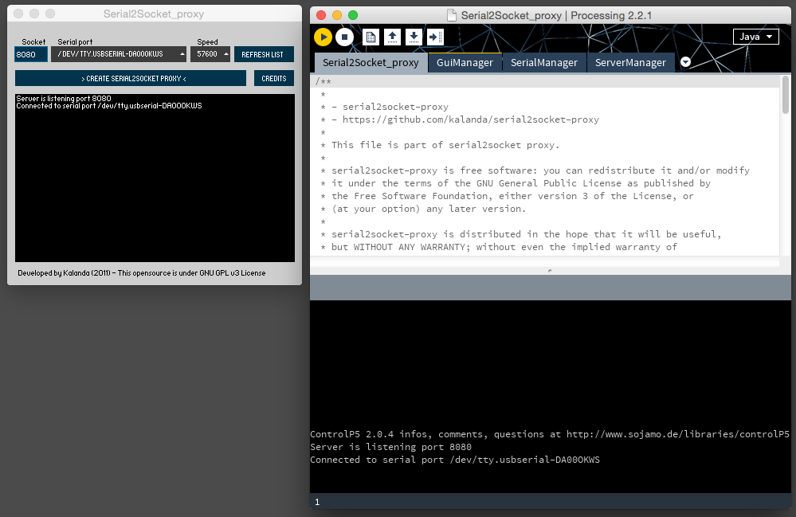

serial2socket-proxy
===================

Description
-----------

serial2socket-proxy is a cross-platform software application developed in Processing that creates a virtual connection between the serial port and a network socket port. 

For example, you can control an Arduino board connected to the serial port from any computer over internet. Also you can use this socket connection for communicate with your arduino board from Flash/Air application programmed in Actionscript, a PHP application or whatever language that can access to a socket. 

## Requirements

To open and execute the source code in Processing, you have to download and install:

- [Download Processing](http://processing.org/download/)
- [Download ControlP5 GUI library for processing](http://www.sojamo.de/libraries/controlP5/#installation)
- [Download WebSocketP5 library for processing](http://muthesius.github.io/WebSocketP5/)
 
License
-------

serial2socket-proxy is free software: you can redistribute it and/or modify it under the terms of the GNU General Public License as published by the Free Software Foundation, either version 3 of the License, or (at your option) any later version.

serial2socket-proxy is distributed in the hope that it will be useful, but WITHOUT ANY WARRANTY; without even the implied warranty of MERCHANTABILITY or FITNESS FOR A PARTICULAR PURPOSE.  See the GNU General Public License for more details. You should have received a copy of the GNU General Public License along with serial2socket-proxy.  If not, see <http://www.gnu.org/licenses/>.
